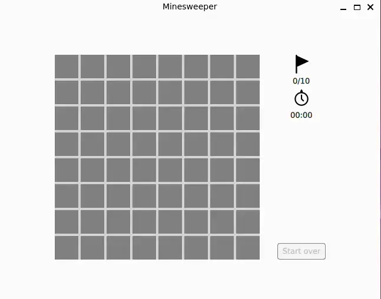

# Qt QML Minesweeper

The QML code uses a Minesweeper game implementation as an example to demonstrate QML layouts, such as `GridLayout` and `ColumnLayout`, and the communication between components using QML signals. For instance, the `Cell` component has a `clicked` signal that triggers the application logic responsible for sweeping nearby cells.

 Screencast 

## Build instructions

The project was created using Qt Design Studio and requires Qt 6.6 or higher. To build the executable, you can use CMake:

    mkdir build
    cd build
    cmake ..
    make

To enable parallel build jobs, use `-j` option with`make`.

If Qt is installed locally, use `CMAKE_PREFIX_PATH` to specify the location of Qt's CMake modules:

    cmake -DCMAKE_PREFIX_PATH=~/Qt/6.6.0/gcc_64/lib/cmake ..

